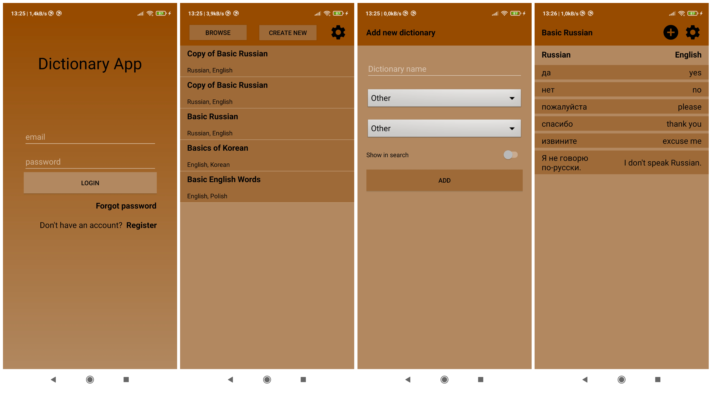

# dictionaryapp
Online dictionary app in Kotlin.

## Table of contents
* [General info](#general-info)
* [Technologies](#technologies)
* [Setup](#setup)

## General info
"Dictionary App" was made as a part of "Introduction to Mobile Applications Development" (Wstęp do programowania aplikacji mobilnych) course at Warsaw University of Technology, Faculty of Electronics and Information Technology.
App is made for people who learn foreign languages or want to have fast access to database of words and their translations.

## Technologies
Project is created with:
* Kotlin language
* Android Studio
* Users log in using Firebase Authentication
* All user data is stored online in Firestore Database
	
## Setup
Project can be run using Android Studio.
Before running your app, please make new project in Firebase. Then download google-services.json file for Android project. Replace existing, empty file in app/ directory. Then turn on Email Authentication and Firestore Database on Firebase management panel.

## Screenshots
Four screenshots from app, but there are more possibilities than that.

